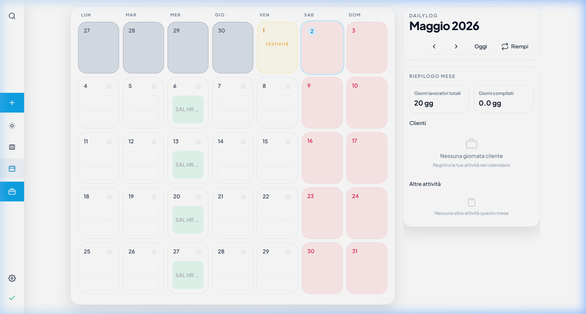
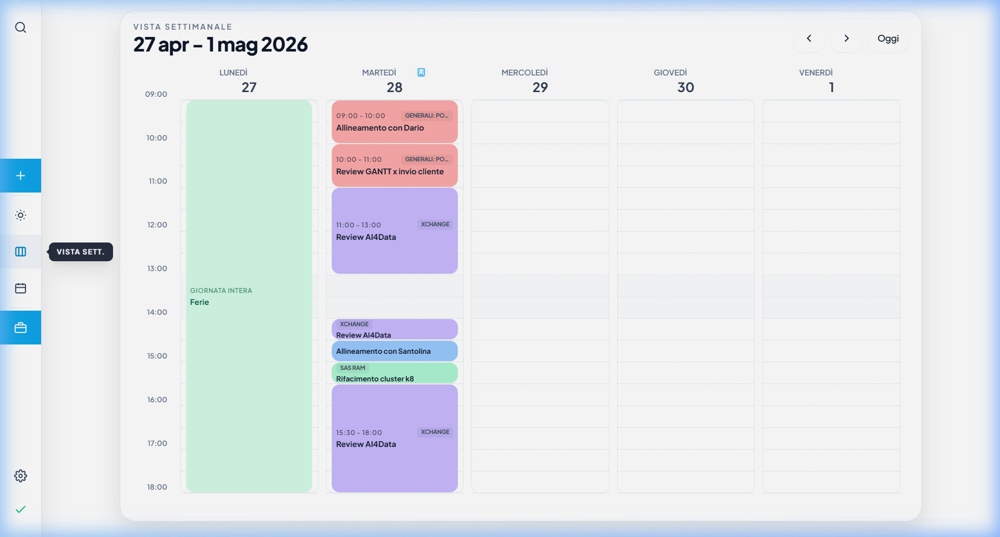
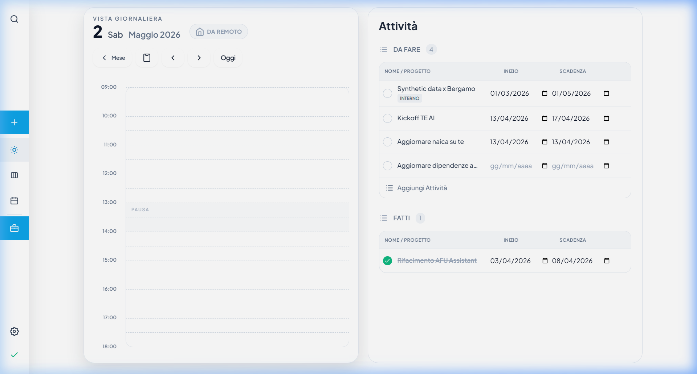
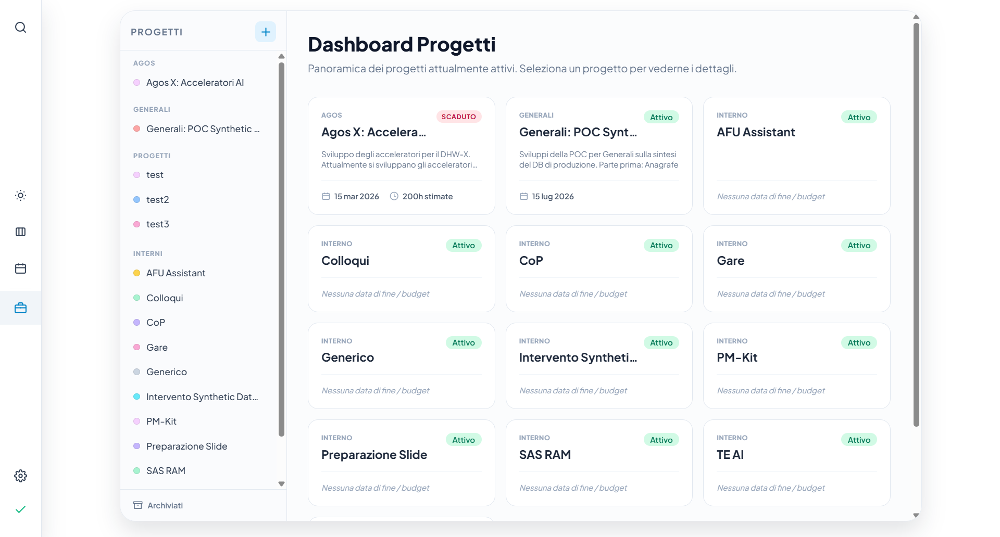
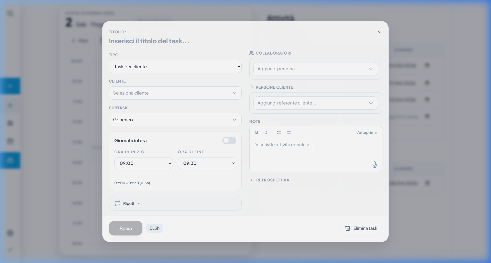
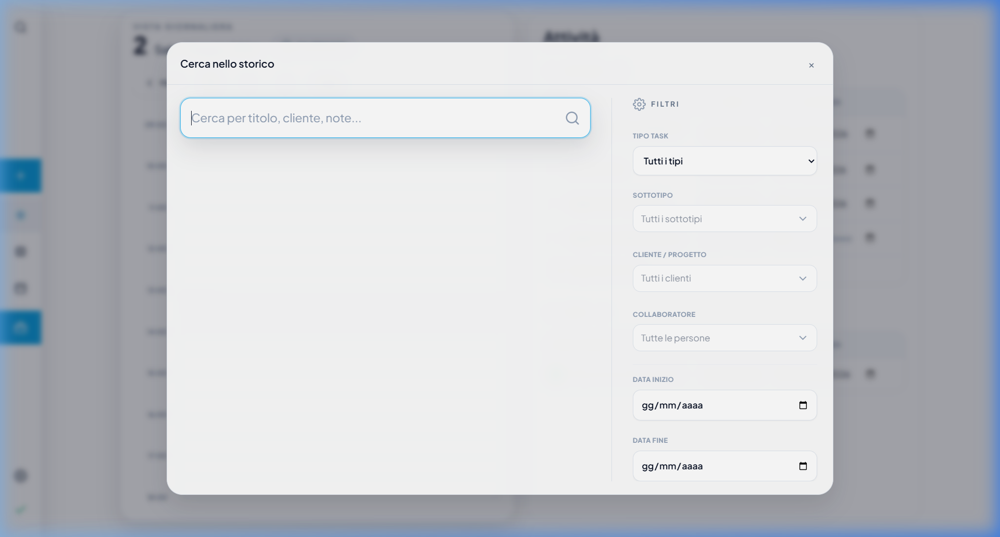
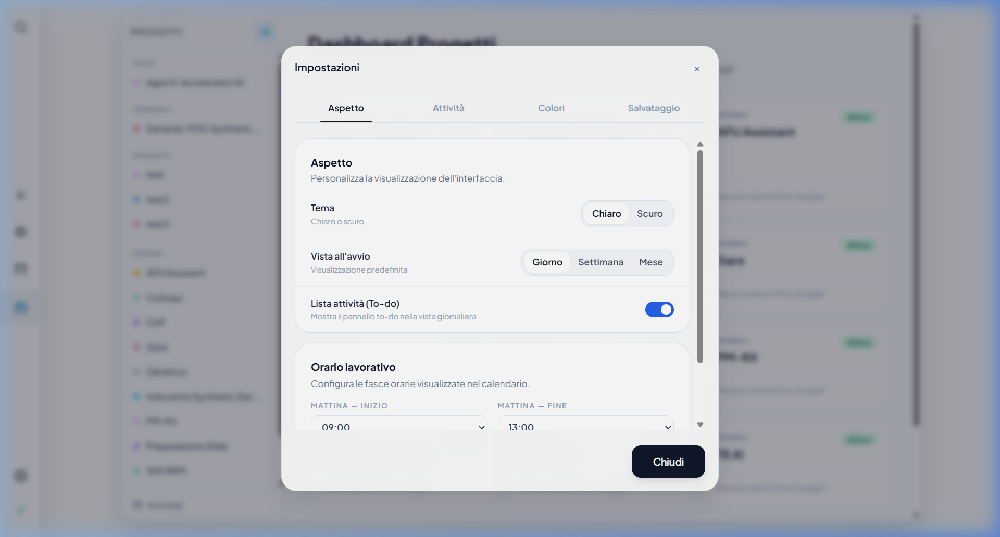

# Panoramica della UI di DailyLog

Ecco una raccolta di screenshot di tutte le principali sezioni e interazioni dell'applicazione DailyLog per aiutarti a valutare eventuali ammodernamenti della UI.

## Viste Principali

### Vista Mensile (Dashboard)
Questa è la vista principale che offre una panoramica del mese.

### Vista Settimanale
Dettaglio delle attività pianificate per la settimana corrente.

### Vista Giornaliera
Dettaglio del singolo giorno con timeline oraria e gestione "DA FARE" / "FATTI".

## Gestione Progetti

### Elenco Progetti
Sezione dedicata alla gestione dei progetti attivi e alla creazione di nuovi.

## Modali e Interazioni

### Inserimento Task (Entry Form)
Il modale per la registrazione di una nuova attività.

### Ricerca Storico
Funzionalità di ricerca avanzata tra le attività passate.

### Impostazioni
Pannello di configurazione del backup e delle preferenze UI.

## Osservazioni sulla UI Attuale
- **Layout**: Utilizza una sidebar fissa a sinistra per la navigazione rapida.
- **Colori**: Predomina una palette chiara con accenti blu e grigi.
- **Componenti**: Utilizza card e liste con ampi spazi bianchi.
- **Interattività**: Presenta stati di hover chiari e animazioni fluide nei modali.
